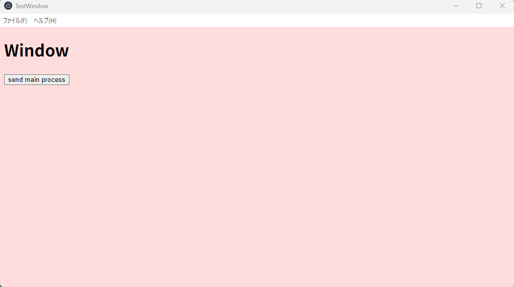
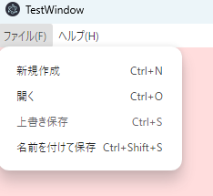

# electron-template

This package provides a set of common modules for developing Electron applications using TypeScript.  
All code is written in **ES Modules (ESM)** format, and it assumes that your application will also follow the ESM structure.

## Introduction

This template simplifies the initial setup of an Electron application.  
It allows you to create windows and menus easily through function calls and method overrides.

The template includes the following features by default:

- configuration file that saves window size and position on exit, and restores them on the next launch
- preload script for communication between the renderer and main processes
- custom exception class
- file handling utility class
- message dialogs

## Installation

```bash
npm install
```

## Usage

To transpile the TypeScript source code:

```bash
npm run tsc
```

To launch the application without any modifications (a default window will appear):

```bash
npm run start
```



A default menu is also displayed automatically (note: the menu does not perform any actions).



### Implementing Your Application

### Initializing method from `MyApp.mts`

First, implement the initialization method in `MyApp.mts`:

```typescript
// File: src/MyApp.mts
protected async myInit(){
	Exception.setLevel(1);
	const win: BaseWindow = new MyWindow();
	await win.init("main.html", "ipc/preload.cjs", this);
	//await win.init("main.html", undefined, this);
	//await win.init("main.html");
}
```

The `init()` method of the `BaseWindow` class initializes the Electron application and creates a window:

```typescript
public async init(loadFile: string, preloadFile?: string, lis?: CloseListener): void
```

#### `loadFile`
Specifies the HTML file to display.
By default, it loads `dist/main.html`.

#### `preloadFile`
Specifies the preload script.
The default preload script defines a communication bridge between the main and renderer processes.
If you don't need a preload script, you can omit this argument or pass `undefined`.

```typescript
// File: src/ipc/preload.cts
contextBridge.exposeInMainWorld("MyBridge", {
	testSend: (no: number) => ipcRenderer.invoke("testSend", no),
});
```
> **Note**
>  The preload script must be written in [CommonJS format](https://blog.softwarenote.info/p4891/).

#### `lis`
Specifies a listener that runs when the window is closed.
The default listener saves the window size and position to a configuration file.
This listener is implemented in the base class and works by simply passing `this`.
You may omit it if not needed.

### Entry Point: `main.mts`

The `MyApp` class is invoked from `main.mts`.
If you change the class name, update it in `main.mts` as well:

```typesciprt
// File: src/main.mts
import MyApp from "./MyApp.mjs";

const main = async () => {
	const appBase: AppBase = new MyApp();
	await appBase.init();
};
```

### Initializing method from `MyWindow.mts`

Next, implement the initialization method in `MyWindow.mts`:

```typescript
// File: src/MyWindow.mts
protected async myInit(){
	this.win?.webContents.openDevTools();
}
```

By default, this simply opens the Developer Tools window.
You can expand upon this to implement your application's logic.

## Notes

### Communication with the Main Process

When the button in the window is clicked, a communication event is triggered to the main process.  
By default, the event handler is implemented in `cmn/BaseWindow.mts`.  
You can override this method if needed.

```typescript
// File: src/cmn/BaseWindow.mts
protected UIhandler(){
	ipcMain.handle("testSend", async (e, no: number) => {
		Exception.log(no);
		return "test" + no;
	});
}
 ```

The click event is detected on the renderer process side in `ipc/renderer.mts`:

```typescript
// File: src/ipc/renderer.mts
window.addEventListener("load", function(){
	let btnEle = document.getElementById("testSend");
	if(btnEle){
		btnEle.addEventListener("click", function(){
			window.MyBridge.testSend(10).then((msg) => {
				console.log(msg);
			});
		});
	}
});
```

### Window Creation

To create a subwindow, simply call the `createWindow()` method from `cmn/BaseWindow.mts`.

```typescript
public static createWindow(title: string = "MainWindow", coord?: Coord, preload?: string): BrowserWindow
```

#### title
Specifies the window title.

#### coord
Specifies the size and position of the window.
It is defined by the `Coord` interface, structured as follows:

```typescript
export interface Coord{
	width: number;
	height: number;
	x: number;
	y: number;
}
```
If not needed, you can omit this argument or pass `undefined`.

#### preload
Specifies the preload script.
This parameter is optional if not required.

### Message Dialogs

To display a message dialog, use the following method in `cmn/BaseWindow.mts`:

```typescript
public static alert(type: number, message: string, title?: string): void
```

#### type
Specifies the message type.
If `1` is specified, it will be treated as an error message.
Other values will be treated as normal messages.

#### message
The main content of the message to display.

#### title
The title of the dialog (optional).

To display a confirmation dialog, use the following method:

```typescript
public static confirm(message: string): boolean
```

#### message
The message content to display in the confirmation dialog.

## License

See [LICENSE](./LICENSE) for details.
